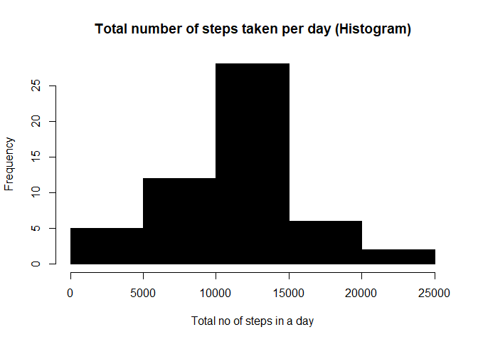
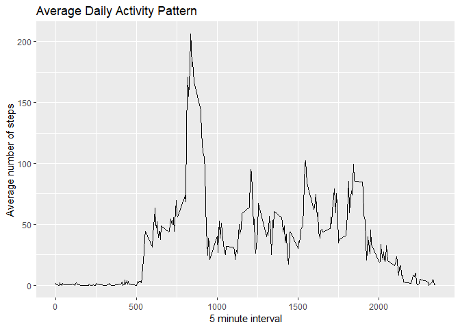
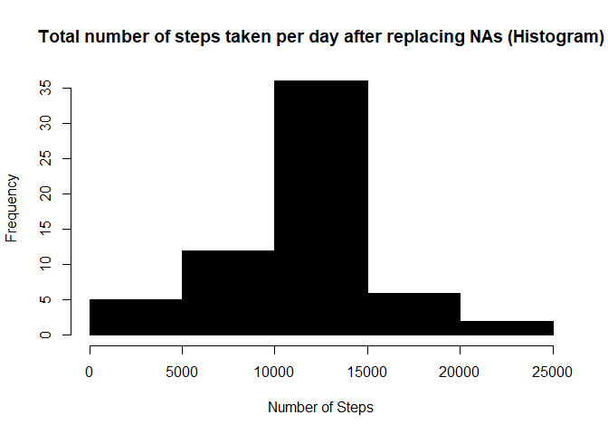
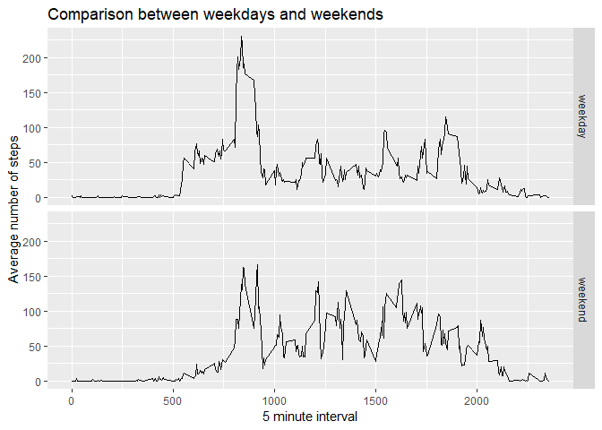

##Introduction

It is now possible to collect a large amount of data about personal movement using activity monitoring devices such as a Fitbit, Nike Fuelband, or Jawbone Up. These type of devices are part of the "quantified self" movement - a group of enthusiasts who take measurements about themselves regularly to improve their health, to find patterns in their behavior, or because they are tech geeks. But these data remain under-utilized both because the raw data are hard to obtain and there is a lack of statistical methods and software for processing and interpreting the data.

This assignment makes use of data from a personal activity monitoring device. This device collects data at 5 minute intervals through out the day. The data consists of two months of data from an anonymous individual collected during the months of October and November, 2012 and include the number of steps taken in 5 minute intervals each day.

The data for this assignment can be downloaded from the course web site:

Dataset: [Activity monitoring data [52K]](https://d396qusza40orc.cloudfront.net/repdata%2Fdata%2Factivity.zip)
The variables included in this dataset are:

steps: Number of steps taking in a 5-minute interval (missing values are coded as NA)
date: The date on which the measurement was taken in YYYY-MM-DD format
interval: Identifier for the 5-minute interval in which measurement was taken
The dataset is stored in a comma-separated-value (CSV) file and there are a total of 17,568 observations in this dataset. 


## Loading and preprocessing the data


```r
data<- read.csv("activity.csv")
data$date<- as.POSIXct(data$date, format="%Y-%m-%d")
na_removed_data <- data[!is.na(data$steps),]
```

## What is mean total number of steps taken per day?

```r
total_steps_in_a_day <- aggregate(na_removed_data$steps, by = list(na_removed_data$date), FUN = sum)
hist(total_steps_in_a_day$x, col= "black", xlab = "Total no of steps in a day", ylab = "Frequency", main = "Total number of steps taken per day (Histogram)")
```

<!-- -->


The mean of total number of steps taken per day is given by :

```r
mean(total_steps_in_a_day$x)
```

```
## [1] 10766.19
```


The median of total number of steps taken per day is given by:

```r
median(total_steps_in_a_day$x)
```

```
## [1] 10765
```

## What is the average daily activity pattern?

```r
library(ggplot2)
avg_no_steps_by_interal <- aggregate(na_removed_data$steps , by = list(na_removed_data$interval), FUN = mean)

ggplot(avg_no_steps_by_interal, aes(avg_no_steps_by_interal$Group.1, avg_no_steps_by_interal$x)) + geom_line() + xlab("5 minute interval")+ ylab("Average number of steps") + ggtitle("Average Daily Activity Pattern")
```

<!-- -->

The 5-minute interval, on average across all the days in the dataset, that contains the maximum number of steps is given by :

```r
max_steps <- which.max(avg_no_steps_by_interal$x)
answer <- avg_no_steps_by_interal[max_steps, "Group.1"]
answer
```

```
## [1] 835
```


## Imputing missing values
The total number of missing values in the dataset are :

```r
sum(is.na(data))
```

```
## [1] 2304
```
The startegy used to fill in the missing values is by filling those values with the mean of the interval of the data. Hence we calculate the mean of steps but broken by the interval using tapply. 

```r
StepsPerInterval <- tapply(data$steps, data$interval, mean, na.rm = TRUE)
# splitting data values into groups based on interval variable
data_split <- split(data, data$interval)

#fill in missing data for each interval
for(i in 1:length(data_split)){
  data_split[[i]]$steps[is.na(data_split[[i]]$steps)] <- StepsPerInterval[i]
}
```
Creating histogram for the changed new data ie after filling in the missing values.

```r
changed_data <- do.call("rbind", data_split)
changed_data <- changed_data[order(changed_data$date) ,]
changed_total_steps_in_a_day <- tapply(changed_data$steps, changed_data$date, sum)
hist(changed_total_steps_in_a_day, xlab = "Number of Steps", ylab = "Frequency" ,main = "Total number of steps taken per day after replacing NAs (Histogram)" ,col = "black")
```

<!-- -->

The mean of total number of steps taken per day is given by :

```r
mean(changed_total_steps_in_a_day)
```

```
## [1] 10766.19
```


The median of total number of steps taken per day is given by:

```r
median(changed_total_steps_in_a_day)
```

```
## [1] 10766.19
```
On comparing with the previous histogram results we can infer that there is no change in the mean value of the data but there is slight increase in the median value. Since the increase is not significant we can say that the added missing values resulted in no significant change in the original activity data.

## Are there differences in activity patterns between weekdays and weekends?

```r
changed_data$week <- ifelse(weekdays(changed_data$date) %in% c("Saturday", "Sunday"), "weekend", "weekday")

table2 <- aggregate(steps ~ interval + week, data=changed_data, mean)
ggplot(table2, aes(interval, steps)) + 
    geom_line() + 
    facet_grid(week ~ .) +
    xlab("5 minute interval") + 
    ylab("Average number of steps") + ggtitle("Comparison between weekdays and weekends")
```

<!-- -->

We can infer from the above graphs that there is difference in activity patterns between weekdays and weekends.

